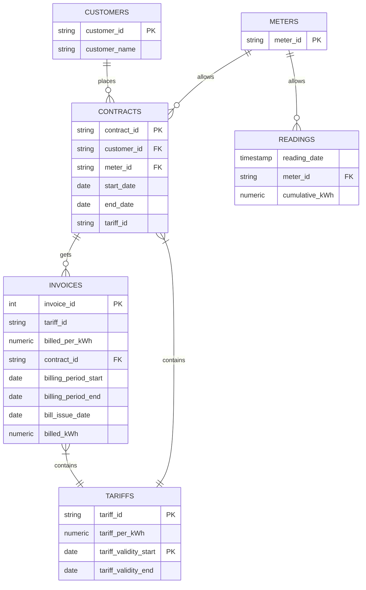

ER-diagram

```mermaid

erDiagram
    CUSTOMERS ||--o{ CONTRACTS : places
    INVOICES |{ -- || TARIFFS : contains
    CONTRACTS |{ -- || TARIFFS: contains
    METERS || -- o{ CONTRACTS : allows
    METERS ||--o{  READINGS: allows
    CONTRACTS ||--o{ INVOICES : gets

    CUSTOMERS {
        string customer_id PK
        string customer_name   
    }
    CONTRACTS {
        string contract_id PK
        string customer_id FK 
        string meter_id FK
        date start_date
        date end_date
        string tariff_id
    }
    METERS {
        string meter_id PK   
    }
    READINGS {
        timestamp reading_date
        string meter_id FK
        numeric cumulative_kWh
    }
    INVOICES {
        int invoice_id PK
        string tariff_id
        numeric billed_per_kWh 
        string contract_id FK
        date billing_period_start
        date billing_period_end
        date bill_issue_date
        numeric billed_kWh
    }
    TARIFFS {
        string tariff_id PK
        numeric tariff_per_kWh
        date tariff_validity_start PK
        date tariff_validity_end
    }

```

